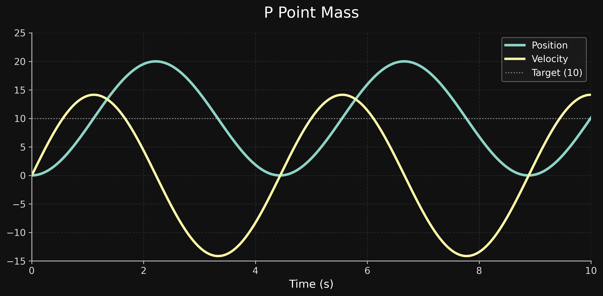
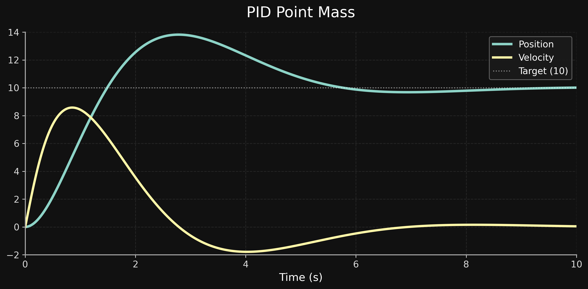
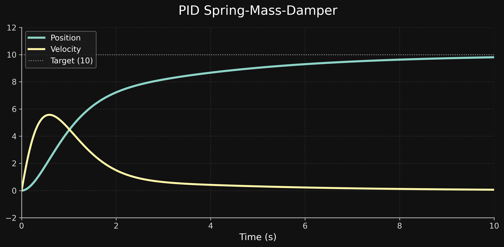
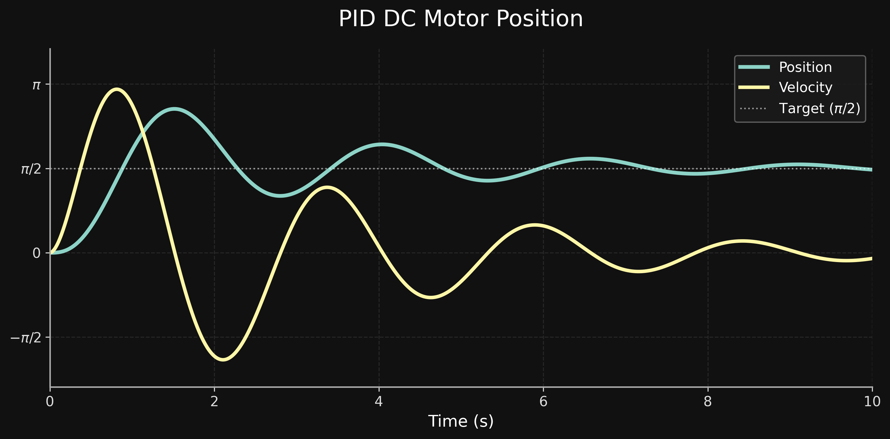
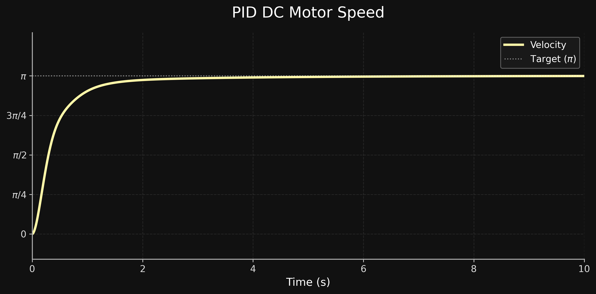

# control-systems-cpp

A modern C++20 library for simulating dynamic systems and implementing classic feedback controllers.

The library provides reusable implementations of **P**, **PI**, **PD**, and **PID** controllers together with several physical plant models, making it suitable for learning control theory, experimenting with controller tuning, and serving as a foundation for more advanced robotics and control projects.

---

## Features

- Modern C++20 implementation
- Classic feedback controllers
  - P
  - PI
  - PD
  - PID
- Built-in plant models
  - Point Mass
  - Spring-Mass-Damper
  - DC Motor
- CSV logging utilities
- Ready-to-run simulation examples
- Comprehensive unit test suite
- CMake build system

---

## Controller Examples

### P Controller — Point Mass

A proportional controller alone cannot stabilize a frictionless point mass. Without damping, the system continuously oscillates around the target.



---

### PID Controller — Point Mass

Adding integral and derivative action eliminates steady-state error and stabilizes the point mass while reducing oscillation.



---

### PID Controller — Spring-Mass-Damper

The PID controller compensates for spring and damping forces, driving the system smoothly toward the desired position.



---

### PID Controller — DC Motor Position

The controller rotates the motor shaft to a desired angular position and brings it to rest with minimal steady-state error.



---

### PID Controller — DC Motor Speed

The controller converges to the target speed and maintains it.



---

## Plant Models

The library currently includes the following dynamic systems:

| Plant            | Description                                               |
| ---------------- | --------------------------------------------------------- |
| PointMass        | Simple translational point-mass model                     |
| SpringMassDamper | Second-order mechanical system with stiffness and damping |
| DCMotor          | Electrical DC motor model for position and speed control  |

---

## Controllers

| Controller | Description                                  |
| ---------- | -------------------------------------------- |
| P          | Proportional control                         |
| PI         | Proportional + Integral control              |
| PD         | Proportional + Derivative control            |
| PID        | Proportional + Integral + Derivative control |

---

## Building

### Requirements

- CMake 3.20+
- C++20 compatible compiler

Clone the repository and build:

```bash
cmake -S . -B build
cmake --build build
```

---

## Running Examples

Examples are built automatically.

```bash
./build/examples/p_point_mass
./build/examples/pid_point_mass
./build/examples/pid_spring_mass_damper
./build/examples/pid_dc_motor_position
./build/examples/pid_dc_motor_speed
```

On Windows, run the corresponding executable from the generated `Debug` or `Release` directory.

---

## Running Tests

Execute the complete test suite:

```bash
ctest --test-dir build --output-on-failure
```

The project currently contains **55 unit tests** covering controllers, plant models, and utility classes.

---

## Project Structure

```text
include/        Public library headers
src/            Library implementation
examples/       Example simulations
tests/          Unit tests
app/            Sample application
scripts/        Plotting scripts
images/         README figures
```

---

## Future Work

Planned additions include:

- Feedforward control
- State-space controllers
- LQR
- Kalman filters
- Additional plant models
- More numerical integration methods
- Interactive visualization tools

---

## License

This project is source-available for educational purposes.

The source code may be viewed and studied, but copying, modification, redistribution, or use in other projects is not permitted without prior written permission.

See the [LICENSE](LICENSE) file for details.
